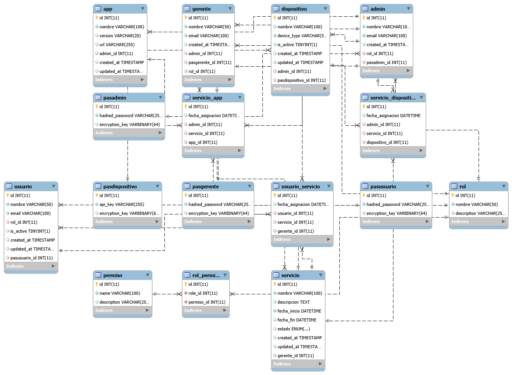

# Plataforma IoT con Seguridad Integrada

**V1.3** | Instalador Automatizado para Debian 13.x/Trixie y derivados basados en Trixie

Sistema completo de monitoreo IoT con autenticación criptográfica de dispositivos, gestión de usuarios multinivel y almacenamiento distribuido de datos de sensores.

---

## Descripción General

Esta plataforma permite desplegar un ecosistema IoT centralizado con mecanismos de seguridad integrados desde la instalación, siguiendo un enfoque security-first for IoT ecosystems. El instalador automatizado reduce las barreras técnicas de adopción al configurar todas las capas de seguridad, bases de datos y servicios de aplicación sin intervención manual. En un servidor Debian 13 limpio con perfil estándar suele completar el despliegue en 10 a 20 minutos; en 2 GB de RAM o almacenamiento compacto puede tardar más.

La arquitectura es agnóstica respecto al escenario de aplicación, lo que permite adaptarla a distintas necesidades operativas sin modificar el núcleo del sistema.

**Nota:** Esta plataforma expone exclusivamente una API REST como backend. Para una experiencia de usuario completa se requiere integrar un frontend (aplicación web, móvil o dashboard) que consuma los endpoints documentados en la sección [Uso de la API](#uso-de-la-api).

**Casos de uso habilitados por la plataforma:**

- Monitoreo continuo de sensores distribuidos geográficamente con recolección centralizada de telemetría
- Gestión de flotas de dispositivos IoT organizados por zonas, servicios o agrupaciones lógicas definidas por el usuario
- Almacenamiento histórico de lecturas para análisis de patrones, tendencias y detección de anomalías
- Sistema de alertas basado en umbrales configurables por tipo de sensor
- Control de acceso diferenciado por roles para operadores, supervisores y administradores

---

## Características Técnicas

### Autenticación Multinivel

El sistema implementa cuatro mecanismos de autenticación independientes, cada uno diseñado para un tipo específico de entidad:

**Usuarios finales**
Acceso de solo lectura para consulta de reportes y visualización de datos históricos. Orientado a personal de monitoreo básico.

**Gerentes operativos**
Permisos para crear servicios, asignar dispositivos a zonas específicas y gestionar usuarios de nivel inferior. Diseñado para coordinadores de área.

**Administradores**
Control total del sistema, incluyendo gestión de roles, permisos, dispositivos y configuración de infraestructura.

**Dispositivos IoT**
Autenticación mediante reto criptográfico basado en AES-256-CBC y HMAC-SHA256. El dispositivo demuestra posesión de la clave secreta sin transmitirla, lo que previene ataques de replay y man-in-the-middle.

### Política de Sesión Única

Cada entidad solo puede mantener una sesión activa de forma simultánea. Si se detecta un intento de inicio de sesión mientras existe una sesión vigente, el sistema rechaza la solicitud con código HTTP 409 Conflict. Esto previene el uso compartido de credenciales y mejora la trazabilidad de acciones.

### Arquitectura de Datos Distribuida

| Base de Datos | Propósito | Modelo |
|---------------|-----------|--------|
| MySQL 8.0 | Entidades del sistema (usuarios, roles, dispositivos, servicios) | Relacional normalizado |
| MongoDB 7.0 | Lecturas de sensores, logs de dispositivos, alertas | Documental con índices optimizados |
| Redis 7 | Sesiones activas, caché de autenticación | Clave-valor en memoria |

Esta separación permite escalar cada componente de forma independiente según las necesidades de carga y retención de datos.

### Capas de Seguridad

El sistema implementa defensa en profundidad mediante cinco capas consecutivas:

1. **nftables**: firewall de red con conjuntos dinámicos de IPs bloqueadas y limitación de conexiones por segundo.
2. **Fail2Ban**: detección de patrones de ataque en logs y bloqueo automático de IPs maliciosas (5 jails activos).
3. **Nginx**: proxy inverso con rate limiting por endpoint, headers de seguridad y filtrado de solicitudes sospechosas.
4. **FastAPI**: validación de tokens JWT, verificación de permisos por rol y sanitización de entradas.
5. **Aislamiento de red**: las bases de datos solo son accesibles desde la red interna de Docker configurada durante la instalación.

Ninguna base de datos acepta conexiones desde el host o internet, lo que elimina vectores de ataque directo.

---

## Requisitos Previos

### Servidor

- Debian 13.x (Trixie) con instalación limpia o derivado basado en Trixie. Debian 13.4 es compatible.
- Arquitectura `amd64` o `arm64`
- El instalador detecta automáticamente el perfil de recursos:
  - `standard`: 4 GB de RAM nominales y 20 GB libres
  - `low-resource`: 2 GB de RAM nominales, 4 núcleos recomendados y 20 GB libres; 32 GB o más recomendado
  - `compact-storage`: 2 GB de RAM nominales, menos de 20 GB libres en `/` y al menos 5 GB libres reales; pensado para laboratorio, demo o cargas IoT livianas con retención limitada
- Conexión a internet estable
- Acceso root o usuario con `sudo`. En una instalación Debian netinst mínima puede no existir `sudo`; en ese caso entrar con `su -` o consola local y ejecutar el instalador como root.
- Dependencias mínimas para obtener el repositorio:

  ```bash
  apt update
  apt install -y git ca-certificates
  ```

### Recomendaciones

- Servidor dedicado o VPS con IP pública estática
- Raspberry Pi OS debe ser 64-bit y basado en Trixie. Raspberry Pi 4/400/CM4 no es compatible con MongoDB 7 porque MongoDB 5.0+ requiere ARMv8.2-A o posterior. El instalador detecta la Pi 4 y pide confirmación explícita para usar `mongo:4.4.30-focal`; no usar ese modo en producción porque MongoDB 4.4 está EOL.
- Acceso a consola del proveedor como respaldo en caso de problemas con SSH
- Snapshot o backup del servidor antes de iniciar la instalación

---

## Instalación

### Clonar el Repositorio

Conectar al servidor vía SSH o consola local e instalar lo mínimo para clonar el repositorio. Si el sistema no tiene `sudo`, ejecutar estos comandos como root:

```bash
sudo apt update
sudo apt upgrade -y
sudo apt install -y git ca-certificates
```

Clonar el repositorio del instalador:

```bash
git clone https://github.com/agustinra24/auto-iotserver
cd auto-iotserver
```

**Nota:** El instalador verifica e instala automáticamente sus dependencias internas al iniciar, incluyendo `curl`, `openssl` y `bc` cuando faltan.

### Asignar Permisos de Ejecución

```bash
chmod +x install.sh lib/*.sh
```

### Vista Previa de Cambios

Antes de modificar el sistema, es posible revisar todas las operaciones que se ejecutarán:

```bash
sudo ./install.sh --dry-run
```

Este modo muestra el plan completo sin aplicar cambios.
No instala paquetes, no escribe en `/etc`, no crea swap, no guarda `.config.env` y no genera secretos.
Si se inició sesión como root, omitir `sudo` en los comandos del instalador.

### Ejecución del Instalador

Iniciar la instalación interactiva:

```bash
sudo ./install.sh
```

El instalador detecta RAM, swap, CPU, almacenamiento total, almacenamiento libre, arquitectura y versión Debian al iniciar. En hosts modestos de 2 GB nominales selecciona `low-resource` automáticamente. En discos con menos de 20 GB libres selecciona `compact-storage` automáticamente si quedan al menos 5 GB libres reales para completar la instalación.

`low-resource` mantiene el stack completo, pero aplica límites y tuning conservador: 1 worker de FastAPI, Redis reducido, caché WiredTiger explícita, buffer pool InnoDB reducido, límites efectivos de Docker Compose y swapfile cuando la RAM es menor a 3 GB y el swap disponible es insuficiente. Está orientado a cargas IoT livianas con baja concurrencia; no reemplaza el perfil estándar como recomendación general.

`compact-storage` es un modo de laboratorio para hosts con poco espacio libre. Usa swapfile de 1 GB y reduce la rotación de logs de Docker. Durante la instalación el administrador decide por separado si activa alertas de almacenamiento y qué modo de purga automática desea cuando el disco cruza el umbral de riesgo:

- `system`: elimina logs, caches Docker, contenedores detenidos, imágenes colgantes y build cache.
- `data`: elimina datos históricos según retención. En MongoDB purga `sensor_readings`, `device_logs` y `alerts` por `timestamp`. En MySQL purga historial relacional antiguo y servicios cerrados, pero no usuarios, admins, dispositivos, credenciales, roles ni permisos.
- `both`: combina `system` y `data`.
- `none`: no purga automáticamente.

Las alertas pueden quedar activas aunque la purga esté desactivada. Esto permite enterarse de presión de almacenamiento aunque el origen sea MySQL, MongoDB o cualquier otro componente.

Raspberry Pi 4/400/CM4 se detecta automáticamente y el instalador pregunta si se acepta el modo legacy de laboratorio. Para ejecución no interactiva existe el override avanzado:

```bash
sudo ./install.sh --allow-legacy-pi4-mongodb
```

Ese modo cambia únicamente la imagen de MongoDB a `mongo:4.4.30-focal` y mantiene el resto del stack. Es una ruta de compatibilidad temporal para laboratorio, no una configuración de producción.

El instalador solicitará estos parámetros de configuración y mostrará los valores detectados del sistema:

- **Dirección IP del servidor**: se detecta automáticamente; confirmar o modificar.
- **Nombre de usuario del sistema**: reemplaza al usuario por defecto de Debian.
- **Puerto SSH personalizado**: se recomienda un puerto no estándar (ej: 5259).
- **Nombre de dominio**: opcional, para configuración futura de SSL/TLS.
- **Perfil detectado**: se calcula automáticamente desde los recursos reales del sistema.
- **Compact storage**: se activa automáticamente cuando el almacenamiento disponible lo requiere.
- **Almacenamiento detectado**: total y libre medidos con `df -Pm`, sin redondeos peligrosos.
- **Alertas de almacenamiento**: `enabled` o `disabled`.
- **Modo de purga**: `system`, `data`, `both` o `none`.
- **Retención de datos**: días mínimos a conservar cuando se activa purga `data` o `both`.
- **Memoria Redis**: por defecto `256mb` en `standard` y `128mb` en `low-resource`.
- **Credenciales del administrador principal**: email y contraseña para la cuenta maestra de la plataforma.

Todos los valores entre corchetes son sugerencias del sistema. Presionar Enter acepta el valor por defecto.

### Validación de Docker Hub y DNS

Después de instalar Docker, el instalador valida explícitamente que Docker pueda llegar a Docker Hub antes de intentar desplegar el stack. Esta validación existe porque en VMware NAT se verificó un fallo real donde el host podía resolver algunos dominios, pero Docker Engine no podía resolver `registry-1.docker.io` usando el DNS NAT `192.168.147.2`.

La validación ejecuta:

```bash
getent hosts registry-1.docker.io
curl -sSIL https://registry-1.docker.io/v2/
docker pull hello-world
docker image rm hello-world:latest
```

Una respuesta HTTP `401` en `https://registry-1.docker.io/v2/` es válida: significa que el registry respondió y pidió autenticación, no que la red esté rota. Si `docker pull hello-world` falla por DNS y el instalador reconoce el gestor de red, aplica una reparación conservadora:

- `dhcpcd`: escribe `/etc/resolv.conf.head` con `1.1.1.1`, `8.8.8.8` y opciones de timeout cortas, después renueva DNS y reinicia Docker.
- `systemd-resolved`: crea un drop-in en `/etc/systemd/resolved.conf.d/`, reinicia `systemd-resolved` y reinicia Docker.
- `NetworkManager`: configura DNS público en la conexión activa, reaplica la conexión y reinicia Docker.
- `resolv.conf` plano: respalda `/etc/resolv.conf` y escribe DNS público.

Además, `/etc/docker/daemon.json` conserva rotación de logs y añade `dns` como defensa secundaria. Esto ayuda a contenedores y al daemon, pero no sustituye la reparación del resolver del host cuando el problema está en el DNS entregado por DHCP/NAT.

Si la red bloquea Docker Hub, TLS, DNS externo o exige proxy corporativo autenticado, el instalador falla temprano con diagnóstico y no intenta inventar un bypass inseguro.

### Proceso de Instalación

El instalador ejecuta 14 fases operativas. En pantalla se numeran internamente de 0 a 13:

0. Preparación y validación de recursos del sistema
1. Creación de usuario administrativo y transición automática
2. Instalación de dependencias base (Python, herramientas de compilación)
3. Configuración de firewall con nftables
4. Despliegue de Fail2Ban con jails para SSH y Nginx
5. Hardening de SSH (cambio de puerto, deshabilitación de root)
6. Instalación de Docker CE y Docker Compose, con validación Docker Hub/DNS antes de deployment
7. Creación de estructura de directorios del proyecto
8. Despliegue de la aplicación FastAPI
9. Inicialización del esquema de base de datos MySQL
10. Configuración de Nginx como proxy inverso
11. Orquestación de contenedores con Docker Compose, usando salida `--progress plain` y diagnóstico detallado en caso de fallo
12. Pruebas de integración y validación de endpoints
13. Limpieza de archivos temporales y verificación final

Cada fase incluye checkpoints. Si la instalación se interrumpe, es posible reanudarla desde el último punto exitoso con `--resume`.

### Tiempo de Instalación

Entre 10 y 20 minutos en perfil estándar, dependiendo de la velocidad del servidor y la latencia de red. En 2 GB de RAM o medios compactos puede tardar más.

### Evidencia de Validación V1.3

V1.3 fue validado en una VM Debian 13.4 ARM64 con 2 GB de RAM nominales y perfil `compact-storage`. La instalación completó 14 de 14 fases; después se verificaron 5 contenedores `healthy`, `/health` local y LAN, bases de datos no expuestas al host, `OOMKilled=false`, `RestartCount=0`, Docker, Fail2Ban y nftables activos, y recuperación correcta tras reboot.

Esta validación cubre laboratorio, demo y cargas IoT livianas. No sustituye pruebas de carga ni endurecimiento adicional para producción pública.

---

## Estructura del Proyecto

Ubicación por defecto: `/home/<usuario>/iot-platform/`

```
iot-platform/
├── docker-compose.yml          # Orquestación de 5 contenedores
├── .env                        # Variables de entorno (credenciales generadas)
├── fastapi-app/                # Código fuente de la aplicación
│   ├── app.py                  # Punto de entrada
│   ├── core/                   # Seguridad, configuración, criptografía
│   ├── models/                 # 13 modelos SQLAlchemy
│   ├── schemas/                # Validación Pydantic
│   ├── api/v1/routers/         # Endpoints REST
│   └── database/               # Gestores de MySQL y MongoDB
├── mysql-init/
│   └── init.sql                # Esquema de base de datos (16 tablas)
├── nginx/
│   ├── nginx.conf              # Configuración principal
│   └── conf.d/
│       └── iot-api.conf        # Site config con rate limiting
├── device-firmware-micropython/ # Firmware MicroPython para ESP32
│   ├── main.py                 # Punto de entrada del firmware
│   ├── Device.py               # Orquestador: sensores, actuadores, auth, telemetria
│   ├── config_manager.py       # Carga config.json, validacion, provisioning UART
│   ├── config.json             # Template de configuracion (placeholders)
│   ├── puzzle_auth.py          # Autenticacion puzzle HMAC-SHA256 + AES-256-CBC
│   ├── http_client.py          # Cliente HTTP con JWT Bearer, retry, backoff
│   ├── hmac_sha256.py          # HMAC-SHA256 manual (RFC 2104)
│   ├── aes256.py               # AES-256-CBC compatible con crypto_new.py
│   ├── WifiControl.py          # WiFi STA con reconexion automatica
│   ├── actuator_logic.py       # Logica local de actuadores (umbrales)
│   ├── temperature_sensor.py   # Sensor DHT11 (GPIO 32)
│   ├── microphone_sensor.py    # Sensor MAX4466 (GPIO 34)
│   ├── led_semaphore.py        # LED semaforo RGB (GPIO 21/22/23)
│   ├── IR_send.py              # Emisor infrarrojo (GPIO 13)
│   └── compute_server_key.py   # Helper para derivar server_key
└── logs/                       # Registros de todos los servicios
    ├── mysql/
    ├── mongodb/
    ├── redis/
    ├── fastapi/
    └── nginx/
```

## Diagrama de Base de Datos



---

## Uso de la API

### Verificación de Estado

Comprobar que todos los servicios están operacionales:

```bash
curl http://<IP_SERVIDOR>/health
```

Respuesta esperada:

```json
{"status": "healthy"}
```

### Autenticación de Administrador

Obtener token JWT para la cuenta maestra:

```bash
curl -X POST http://<IP_SERVIDOR>/api/v1/auth/login/admin \
  -H "Content-Type: application/json" \
  -d '{
    "email": "admin@example.com",
    "password": "tu_contraseña_segura"
  }'
```

Respuesta:

```json
{
  "access_token": "eyJhbGciOiJIUzI1NiIsInR5cCI6IkpXVCJ9...",
  "token_type": "bearer",
  "admin_id": 1,
  "role": "admin_master"
}
```

### Uso del Token

Incluir el token en el header `Authorization` de las solicitudes subsecuentes:

```bash
curl http://<IP_SERVIDOR>/api/v1/users \
  -H "Authorization: Bearer <token>"
```

### Cerrar Sesión

Invalidar el token actual:

```bash
curl -X POST http://<IP_SERVIDOR>/api/v1/auth/logout \
  -H "Authorization: Bearer <token>"
```

### Documentación Interactiva

La API incluye interfaz Swagger para exploración y pruebas:

```
http://<IP_SERVIDOR>/docs
```

---

## Autenticación de Dispositivos

Los sensores IoT utilizan un protocolo de autenticación basado en retos criptográficos que previene ataques de replay y protege las claves secretas.

### Fundamento Criptográfico

Cada dispositivo posee una clave de cifrado `K_device` de 32 bytes almacenada de forma segura. El servidor mantiene una clave complementaria `K_server` derivada de la clave maestra JWT.

**Proceso de autenticación:**

1. El dispositivo genera un número aleatorio `R2` (32 bytes).
2. Calcula el parámetro de identidad: `P2 = HMAC-SHA256(K_device || K_server, R2)`.
3. Cifra el parámetro: `P2c = AES-256-CBC(P2, K_device, IV_aleatorio)`.
4. Envía al servidor: `{id_origen, R2, P2c}`.
5. El servidor reconstruye `P2` usando su copia de `K_device`.
6. Descifra `P2c` y compara el resultado con su propio cálculo.
7. Si coinciden, emite un JWT con validez de 24 horas.

El dispositivo demuestra posesión de `K_device` sin transmitirla en ningún momento.

### Endpoints de Prueba

Para facilitar el desarrollo, la API incluye endpoints auxiliares que simulan el comportamiento del dispositivo:

**Inicializar clave del dispositivo:**

```bash
curl -X POST "http://<IP>/api/v1/auth/device/init-encryption-key?device_id=1"
```

**Generar reto criptográfico de prueba:**

```bash
curl -X POST "http://<IP>/api/v1/auth/device/generate-puzzle-test?device_id=1"
```

Estos endpoints solo deben usarse en entornos de desarrollo. En producción, los dispositivos generan sus propios retos.

---

## Gestión de Datos de Sensores

Los dispositivos envían lecturas a MongoDB mediante el endpoint de telemetría.

### Enviar Lecturas

```bash
curl -X POST http://<IP>/api/v1/device/reading \
  -H "Authorization: Bearer <device_token>" \
  -H "Content-Type: application/json" \
  -d '{
    "device_id": 1,
    "temperature": 28.5,
    "humidity": 12,
    "battery": 87,
    "location": "Sector Norte - Zona A"
  }'
```

El sistema normaliza automáticamente las lecturas, creando un documento por cada tipo de sensor (temperatura, humedad, batería).

### Consultar Histórico

```bash
curl "http://<IP>/api/v1/devices/1/readings?sensor_type=temperature&limit=100" \
  -H "Authorization: Bearer <user_token>"
```

Parámetros de consulta disponibles:

- `sensor_type`: filtrar por tipo (temperature, humidity, battery).
- `start_date`: fecha de inicio (ISO 8601).
- `end_date`: fecha de fin (ISO 8601).
- `limit`: máximo de registros (default: 100, max: 1000).

---

## Modelo de Datos

### Esquema Relacional (MySQL)

El sistema implementa RBAC (Role-Based Access Control) con 16 tablas:

**Entidades principales:**

- `usuario`, `gerente`, `admin`: cuentas del sistema.
- `dispositivo`: sensores IoT registrados.
- `servicio`: agrupaciones lógicas de dispositivos.
- `app`: aplicaciones cliente que consumen la API.

**Control de acceso:**

- `rol`: perfiles de permisos (admin_master, admin_normal, manager, user).
- `permiso`: acciones granulares (create_user, edit_device, view_reports, etc.).
- `rol_permiso`: tabla de unión muchos a muchos.

**Seguridad:**

- `pasusuario`, `pasgerente`, `pasadmin`, `pasdispositivo`: almacenamiento aislado de credenciales.

**Relaciones:**

- `servicio_dispositivo`, `servicio_app`, `usuario_servicio`: tablas de unión para asignaciones muchos a muchos entre servicios, dispositivos, aplicaciones y usuarios.

Las contraseñas se hashean con Argon2id usando parámetros resistentes a ataques GPU:

- 100 MB de memoria
- 2 iteraciones
- 8 hilos paralelos

### Colecciones de MongoDB

**sensor_readings**: lecturas normalizadas de sensores.

```javascript
{
  device_id: "1",
  sensor_type: "temperature",
  value: 28.5,
  unit: "°C",
  location: "Sector Norte",
  timestamp: ISODate("2024-12-16T10:30:00Z")
}
```

**device_logs**: eventos de dispositivos (conexión, desconexión, errores).

**alerts**: alertas generadas al superar umbrales configurados.

Índices optimizados para consultas por dispositivo, tipo de sensor y rango temporal.

---

## Verificación Post-Instalación

### Estado de Contenedores

Todos los servicios deben estar en estado "healthy":

```bash
cd ~/iot-platform
sudo docker compose ps
```

Salida esperada (5 contenedores):

```
NAME            STATUS          PORTS
iot-mysql       Up (healthy)    
iot-mongodb     Up (healthy)    
iot-redis       Up (healthy)    
iot-fastapi     Up (healthy)    5000/tcp
iot-nginx       Up (healthy)    0.0.0.0:80->80/tcp, 0.0.0.0:443->443/tcp
```

### Aislamiento de Bases de Datos

Verificar que ninguna base de datos acepta conexiones externas:

```bash
nc -zv localhost 3306   # MySQL - debe fallar
nc -zv localhost 6379   # Redis - debe fallar
nc -zv localhost 27017  # MongoDB - debe fallar
```

Si algún puerto responde, existe un problema de configuración de seguridad.

### Jails de Fail2Ban

Confirmar que los 5 jails están activos:

```bash
sudo fail2ban-client status
```

Salida esperada:

```
|- Number of jail:      5
`- Jail list:   nginx-badbots, nginx-botsearch, nginx-http-auth, 
                nginx-limit-req, sshd
```

### Prueba de Autenticación

Verificar los tres tipos de login de usuarios:

```bash
# Usuario
curl -X POST http://localhost/api/v1/auth/login/user \
  -H "Content-Type: application/json" \
  -d '{"email":"user@iot-platform.local","password":"password123"}'

# Gerente
curl -X POST http://localhost/api/v1/auth/login/manager \
  -H "Content-Type: application/json" \
  -d '{"email":"gerente@iot-platform.local","password":"password123"}'

# Administrador
curl -X POST http://localhost/api/v1/auth/login/admin \
  -H "Content-Type: application/json" \
  -d '{"email":"<tu_email>","password":"<tu_contraseña>"}'
```

---

## Tareas Posteriores a la Instalación

### Críticas

1. **Respaldar archivo de secretos**

   ```bash
   cat ~/.iot-platform/.secrets
   ```

   Este archivo contiene todas las contraseñas generadas automáticamente. Sin él, no es posible recuperar acceso a las bases de datos.

2. **Cambiar contraseña del usuario del sistema**

   ```bash
   passwd
   ```

3. **Eliminar usuarios de prueba**

   Los usuarios `user@iot-platform.local` y `gerente@iot-platform.local` tienen contraseñas por defecto. Deben eliminarse en entornos de producción.

### Recomendadas

- Configurar certificados SSL/TLS con Let's Encrypt para habilitar HTTPS
- Establecer backups automáticos de MySQL y MongoDB
- Configurar monitoreo de métricas (Prometheus + Grafana)
- Ajustar parámetros de rate limiting según la carga esperada

---

## Solución de Problemas

### Instalación Interrumpida

El instalador guarda checkpoints en `.install-state`. Para reanudar:

```bash
sudo ./install.sh --resume
```

### Problemas de Conexión SSH

El puerto SSH cambia durante la instalación. Verificar el puerto configurado:

```bash
grep "SSH_PORT=" .config.env
```

Conectar usando el nuevo puerto:

```bash
ssh <usuario>@<ip> -p <puerto>
```

Si no se puede acceder por SSH, usar la consola local, del hipervisor, o del proveedor.

### Contenedor No Inicia

Ver logs detallados del contenedor problemático:

```bash
cd ~/iot-platform
sudo docker compose logs <nombre_contenedor> --tail=50
```

Reiniciar un contenedor específico:

```bash
sudo docker compose restart <nombre_contenedor>
```

### Fase 11 Falla al Descargar Imágenes Docker

Si aparece un error similar a `lookup registry-1.docker.io ... no such host`, el problema está en la resolución DNS hacia Docker Hub, no en MySQL, MongoDB ni FastAPI. El instalador v1.3 valida este punto en Fase 6 y, si reconoce el gestor de red, intenta corregirlo antes del deployment.

Diagnóstico manual:

```bash
getent hosts registry-1.docker.io
curl -sSIL https://registry-1.docker.io/v2/
docker pull hello-world
cat /etc/resolv.conf
systemctl is-active systemd-resolved NetworkManager networking
```

En VMware NAT con `dhcpcd`, el caso observado fue `/etc/resolv.conf` generado con `nameserver 192.168.147.2`. La reparación persistente aplicada por el installer usa `/etc/resolv.conf.head`:

```bash
cat /etc/resolv.conf.head
systemctl restart docker
docker pull hello-world
```

Si el fallo ocurre en una red corporativa, escolar o detrás de proxy autenticado, se requiere permitir Docker Hub o configurar proxy de Docker. El instalador no omite TLS ni usa mirrors no confiables.

### Fail2Ban No Inicia

Verificar errores de configuración:

```bash
sudo fail2ban-server -f --loglevel DEBUG 2>&1 | head -50
```

Error común: los archivos de log de Nginx aún no existen. Solución:

```bash
cd ~/iot-platform/logs/nginx
sudo touch iot-api-access.log iot-api-error.log
sudo systemctl restart fail2ban
```

### Error de Autenticación de Dispositivo

Si la verificación del reto criptográfico falla:

1. Verificar que la clave del dispositivo existe:

   ```bash
   sudo docker exec iot-mysql mysql -u root -p<password> -e \
     "SELECT id, LENGTH(encryption_key) FROM iot_platform.pasdispositivo WHERE id=1;"
   ```

2. Reinicializar la clave si es necesario:

   ```bash
   curl -X POST "http://localhost/api/v1/auth/device/init-encryption-key?device_id=1"
   ```

---

## Stack Tecnológico

| Componente | Versión | Propósito |
|------------|---------|-----------|
| Debian | 13 (Trixie) | Sistema operativo base |
| Docker | CE + Compose v2 preferido; fallback Debian `docker.io` + `docker-compose` si CE no aparece en APT | Contenedorización y orquestación |
| FastAPI | 0.110.0 | Framework de API asíncrona |
| Uvicorn | 0.27.1 | Servidor ASGI |
| SQLAlchemy | 2.0.25 | ORM para MySQL |
| MySQL | 8.0 | RDBMS para datos estructurados |
| MongoDB | 7.0 por defecto, 4.4.30-focal solo en modo legacy Pi 4 confirmado | NoSQL para series temporales |
| PyMongo | 4.6.0 | Cliente de MongoDB |
| Redis | 7 | Store de sesiones en memoria |
| Nginx | 1.25-alpine | Proxy inverso y balanceador |
| nftables | - | Firewall de red |
| Fail2Ban | - | Sistema de prevención de intrusiones |
| Passlib | 1.7.4 | Librería de hashing |
| Argon2-cffi | 23.1.0 | Implementación de Argon2 |
| python-jose | 3.3.0 | Manejo de JWT |
| Pydantic | 2.5.3 | Validación de datos |
| PyCryptodome | 3.20.0 | Primitivas criptográficas |

---

## Contribución

Las contribuciones son bienvenidas. Este proyecto está diseñado para ser extensible y adaptable a diferentes escenarios de monitoreo IoT.

**Áreas de mejora identificadas:**

- Implementación de alertas en tiempo real vía WebSockets
- Dashboard web para visualización de datos
- Integración con sistemas de notificación (SMS, email, push)
- Soporte para protocolos MQTT y CoAP
- Mecanismo de actualización automática de la plataforma
- Tests automatizados de integración y carga
- Documentación de API en formato OpenAPI 3.1

Para proponer cambios:

1. Fork del repositorio
2. Crear rama con nombre descriptivo (`feature/nueva-funcionalidad`)
3. Commit de cambios con mensajes claros
4. Push a la rama
5. Abrir Pull Request con descripción detallada

Revisar primero la arquitectura existente y verificar la compatibilidad con el esquema de autenticación actual.

---

## Firmware del Dispositivo (MicroPython)

El directorio `device-firmware-micropython/` contiene el firmware funcional para dispositivos ESP32 con MicroPython (v1.20+). Este firmware implementa el mismo protocolo de autenticación por puzzle criptográfico que la API espera (HMAC-SHA256 + AES-256-CBC) y se comunica con el servidor usando tokens JWT Bearer.

Durante la instalación, el firmware se copia automáticamente a `iot-platform/device-firmware-micropython/` para que el administrador del servidor pueda flashear dispositivos ESP32 directamente desde la plataforma desplegada.

### Capacidades del firmware

- Autenticación por puzzle criptográfico: HMAC-SHA256 + AES-256-CBC, compatible byte-a-byte con `crypto_new.py` del servidor
- Sesiones JWT Bearer con re-autenticación automática al expirar el token
- Envío de telemetría (temperatura, humedad) como JSON a `POST /api/v1/device/reading`
- Reconexión WiFi automática con backoff exponencial
- Sincronización de reloj vía NTP para timestamps ISO 8601
- Actuadores locales: LED semáforo (rojo/amarillo/verde según nivel de ruido) y emisor infrarrojo
- Configuración desde archivo `config.json` en flash, con modo de provisioning interactivo por UART si no existe
- Datos simulados cuando los sensores físicos no están conectados

### Provisionamiento del dispositivo

**Opcion recomendada: Web Flasher** (`web-flasher/index.html`)

Herramienta grafica en navegador (Chrome/Edge) que automatiza todo el proceso de despliegue:

1. Diagnostico del chip ESP32 (modelo, MAC, flash)
2. Flash de MicroPython v1.25.0 con borrado de flash
3. Subida de los 14 modulos .py del firmware via Raw REPL
4. Configuracion por drag-and-drop de config.json (generado por `compute_server_key.py`) o formulario manual
5. Monitor serial en tiempo real con filtro, timestamps y deteccion automatica de errores
6. Gestion post-provisionamiento: lectura/edicion de config, explorador de archivos, actualizacion quirurgica

Incluye escaneo de redes WiFi del ESP32, reporte de provisionamiento descargable, codigo QR para etiquetado de dispositivos, y documentacion integrada del firmware. Ver `web-flasher/README.md` para documentacion tecnica completa.

```bash
cd web-flasher && python3 -m http.server 8080
# Abrir http://localhost:8080 en Chrome
```

**Opcion alternativa: linea de comandos**

1. Flashear MicroPython al ESP32 con esptool
2. Generar config.json: `uv run device-firmware-micropython/compute_server_key.py`
3. Subir archivos con mpremote: `mpremote cp device-firmware-micropython/*.py :`

Hardware soportado: ESP32-WROOM-32D con sensores DHT11 (GPIO 32), MAX4466 (GPIO 34), LED RGB (GPIO 21/22/23), IR (GPIO 13).

---

## Licencia

Este proyecto se distribuye bajo los términos especificados en el archivo LICENSE del repositorio.

---

## Soporte

Para problemas de instalación, revisar primero el log generado:

```bash
cat ~/iot-platform-installer/logs/install-<fecha>.log
```

Este archivo contiene el registro completo de todas las operaciones y mensajes de error detallados.

Para problemas operacionales, verificar los logs de cada servicio:

```bash
# FastAPI
sudo docker logs iot-fastapi --tail=100

# Nginx
sudo docker logs iot-nginx --tail=100

# MySQL
sudo docker logs iot-mysql --tail=100

# MongoDB
sudo docker logs iot-mongodb --tail=100
```

---

**V1.3** | Abril 2026
Plataforma IoT con Seguridad Integrada
