## Firmware MicroPython para ESP32 (IoT Device) — V1.2

Firmware modular para ESP32 que se comunica con la API FastAPI del auto-iotserver. Lee sensores de temperatura, humedad y ruido, controla actuadores (LED semaforo, IR) con logica local, y envia telemetria al servidor usando autenticacion criptografica de puzzle (HMAC-SHA256 + AES-256-CBC) con tokens JWT. Incluye toggle fisico (GPIO 0 / BOOT) para pausar/reanudar el envio de datos sin detener la lectura de sensores.

### Requisitos

- ESP32-WROOM-32D con MicroPython (v1.20+)
- Sensores: DHT11 (GPIO 32), MAX4466 microfono (GPIO 34)
- Actuadores: LED semaforo RGB (GPIO 21/22/23), IR emisor (GPIO 13)
- Servidor auto-iotserver desplegado con Docker

### Provisionamiento

1. Flashear MicroPython al ESP32
2. Registrar el dispositivo en la API (admin crea device, obtiene `device_id`, `api_key`, `encryption_key`)
3. Generar `config.json` con el script de provisionamiento:
   ```
   uv run compute_server_key.py
   ```
   El script lee automaticamente `~/.iot-platform/.secrets` (generado por el installer), computa `server_key`, extrae las credenciales del dispositivo, y solo pide WiFi SSID y password. Si `.secrets` no esta disponible, entra en modo interactivo para todos los campos.
4. Subir los 14 archivos `.py` del firmware y `config.json` al ESP32 via el web flasher (`web-flasher/index.html`), `mpremote`, o UART

El **web flasher** (abrir `web-flasher/index.html` en Chrome) automatiza los pasos 1, 3 y 4 desde el navegador: flashea MicroPython, sube los archivos via Raw REPL, y despliega el config.json. Incluye escaneo de redes WiFi, monitor serial, y deteccion automatica de errores de sesion Redis.

Si `config.json` no existe o tiene valores placeholder en `api_key`/`device_key`, el firmware entra en modo de configuracion interactiva por UART al arrancar.

### Estructura

```
main.py                 Entry point, secuencia de boot
Device.py               Orquestador: sensores + actuadores + auth + telemetria
config_manager.py       Carga config.json, validacion, provisioning UART
config.json             Credenciales y configuracion (template con placeholders)
puzzle_auth.py          Autenticacion puzzle HMAC-SHA256 + AES-256 -> JWT
http_client.py          Cliente HTTP con JWT Bearer, retry, backoff
hmac_sha256.py          HMAC-SHA256 manual (RFC 2104, MicroPython no tiene hmac)
aes256.py               AES-256-CBC compatible con crypto_new.py del servidor
WifiControl.py          WiFi STA con reconexion automatica y backoff
actuator_logic.py       Logica local de actuadores (umbrales de config.json)
temperature_sensor.py   Sensor DHT11 (temperatura y humedad)
microphone_sensor.py    Sensor MAX4466 (nivel de ruido por ADC)
led_semaphore.py        LED semaforo RGB (rojo/amarillo/verde)
IR_send.py              Transmisor infrarrojo PWM 38kHz
button_toggle.py        Toggle GPIO 0 (BOOT) para pausar/reanudar envio al servidor
compute_server_key.py   Script host PEP 723: lee .secrets, computa server_key, genera config.json
```

### Protocolo de autenticacion

El firmware usa el mismo protocolo de puzzle criptografico que la API espera:

1. Genera R2 (32 bytes aleatorios)
2. Calcula P2 = HMAC-SHA256(device_key || server_key, R2)
3. Cifra P2 con AES-256-CBC usando device_key
4. Envia puzzle_response a `POST /api/v1/auth/device/login`
5. Recibe JWT con expiracion de 24h
6. Usa JWT como Bearer token para enviar lecturas a `POST /api/v1/device/reading`

### Flujo de ejecucion

Los numeros indican el orden secuencial de ejecucion. Flechas solidas = flujo principal, punteadas = dependencias.

```mermaid
flowchart TD

    %% ══════════════════════════════════════════════
    %% FASE 1: ARRANQUE
    %% ══════════════════════════════════════════════
    subgraph F1["FASE 1 — ARRANQUE"]
        S1["<b>1 · main.py</b><br/>Entry point"]
        S2["<b>2 · config_manager.py</b><br/>Carga config, valida keys<br/>Decodifica hex → 32 bytes"]
        DB[("<b>config.json</b><br/>Credenciales, WiFi<br/>server URL, umbrales")]

        S1 --> S2
        DB -.->|"lee"| S2
    end

    %% ══════════════════════════════════════════════
    %% FASE 2: INICIALIZACION DE SUBSISTEMAS
    %% ══════════════════════════════════════════════
    subgraph F2["FASE 2 — INICIALIZACION"]
        S3["<b>3 · Device.py</b><br/>Orquestador central"]
        S4["<b>4 · WifiControl.py</b><br/>WiFi STA, 3 reintentos<br/>Backoff 15s / 20s / 30s"]
        S5["<b>5 · NTP sync</b><br/>Reloj UTC via ntptime<br/><i>No-fatal si falla</i>"]
        S6["<b>6 · Sensores</b><br/>temperature_sensor.py — DHT11<br/>microphone_sensor.py — MAX4466"]
        S7["<b>7 · Actuadores</b><br/>led_semaphore.py — LED RGB<br/>IR_send.py — IR 38kHz"]
        S7b["<b>8 · button_toggle.py</b><br/>GPIO 0 (BOOT)<br/>Pausa/reanuda envio"]

        S3 --> S4 --> S5 --> S6 --> S7 --> S7b
    end

    %% ══════════════════════════════════════════════
    %% AUTENTICACION: PUZZLE CRIPTOGRAFICO
    %% ══════════════════════════════════════════════
    subgraph AUTH["AUTENTICACION — Puzzle Criptografico"]
        S8["<b>9 · puzzle_auth.py</b><br/>R2 = 32 bytes aleatorios<br/>Orquesta protocolo completo"]

        HMAC["<b>hmac_sha256.py</b><br/>HMAC-SHA256 segun RFC 2104<br/><i>Impl. manual: MicroPython<br/>no tiene modulo hmac</i>"]
        AES["<b>aes256.py</b><br/>AES-256-CBC + PKCS7<br/><i>Padding manual: ucryptolib<br/>no incluye PKCS7</i>"]

        S9["<b>10 · http_client.py</b><br/>POST JSON + Bearer token<br/>Retry con backoff 1s / 3s / 9s"]

        SRV{{"<b>FastAPI Server</b><br/>POST /api/v1/auth/device/login<br/>Valida puzzle vs crypto_new.py"}}

        S10(["<b>11 · JWT Token obtenido</b><br/>HS256 · 24h · sesion unica Redis"])

        S8 -.->|"P2 = HMAC(device_key ‖ server_key, R2)"| HMAC
        S8 -.->|"P2c = AES(P2, device_key, IV_random)"| AES
        S8 -->|"construye y envia puzzle"| S9
        S9 -->|"POST"| SRV
        SRV -->|"200 OK"| S10
    end

    %% ══════════════════════════════════════════════
    %% FASE 3: LOOP DE TELEMETRIA
    %% ══════════════════════════════════════════════
    subgraph F3["FASE 3 — LOOP DE TELEMETRIA · repite cada N segundos"]
        direction LR
        L1{"WiFi OK?<br/><i>reconnect si no</i>"}
        L2["Leer sensores<br/>3x temp/hum<br/>5x ruido"]
        L3["<b>actuator_logic.py</b><br/>LED = f(ruido)<br/>IR = f(temp, hum)<br/><i>100% local</i>"]
        L3b{"Envio<br/>habilitado?<br/><i>button_toggle</i>"}
        L4["<b>POST /reading</b><br/>Bearer JWT<br/><i>Solo temp + humidity</i><br/><i>Ruido no se envia</i>"]
        L5(["sleep(interval)"])

        L1 -->|"OK"| L2 --> L3 --> L3b
        L3b -->|"si"| L4 --> L5
        L3b -->|"no (pausado)"| L5
        L5 -->|"repite"| L1
    end

    %% ══════════════════════════════════════════════
    %% CONEXIONES ENTRE FASES (flujo secuencial)
    %% ══════════════════════════════════════════════
    S2 ==> S3
    S7b ==> S8
    S10 ==> L1

    %% ══════════════════════════════════════════════
    %% ESTILOS
    %% ══════════════════════════════════════════════

    %% Fondos de fase
    style F1 fill:#dbeafe,stroke:#3b82f6,stroke-width:2px,color:#1e1e1e
    style F2 fill:#ede9fe,stroke:#8b5cf6,stroke-width:2px,color:#1e1e1e
    style AUTH fill:#fee2e2,stroke:#ef4444,stroke-width:2px,color:#1e1e1e
    style F3 fill:#dcfce7,stroke:#22c55e,stroke-width:2px,color:#1e1e1e

    %% Fase 1: azul
    style S1 fill:#bfdbfe,stroke:#2563eb,color:#1e1e1e
    style S2 fill:#bfdbfe,stroke:#2563eb,color:#1e1e1e
    style DB fill:#a7f3d0,stroke:#059669,color:#1e1e1e

    %% Fase 2: morado/naranja/amarillo
    style S3 fill:#c4b5fd,stroke:#7c3aed,stroke-width:2px,color:#1e1e1e
    style S4 fill:#fed7aa,stroke:#ea580c,color:#1e1e1e
    style S5 fill:#fed7aa,stroke:#ea580c,color:#1e1e1e
    style S6 fill:#fef08a,stroke:#ca8a04,color:#1e1e1e
    style S7 fill:#fef08a,stroke:#ca8a04,color:#1e1e1e
    style S7b fill:#c4b5fd,stroke:#7c3aed,color:#1e1e1e

    %% Auth: rojo
    style S8 fill:#fca5a5,stroke:#dc2626,stroke-width:2px,color:#1e1e1e
    style HMAC fill:#fca5a5,stroke:#dc2626,color:#1e1e1e
    style AES fill:#fca5a5,stroke:#dc2626,color:#1e1e1e
    style S9 fill:#c4b5fd,stroke:#7c3aed,color:#1e1e1e
    style SRV fill:#fed7aa,stroke:#ea580c,stroke-width:2px,color:#1e1e1e
    style S10 fill:#86efac,stroke:#16a34a,stroke-width:2px,color:#1e1e1e

    %% Loop: verde/amarillo
    style L1 fill:#fed7aa,stroke:#ea580c,color:#1e1e1e
    style L2 fill:#fef08a,stroke:#ca8a04,color:#1e1e1e
    style L3 fill:#fef08a,stroke:#ca8a04,color:#1e1e1e
    style L3b fill:#c4b5fd,stroke:#7c3aed,color:#1e1e1e
    style L4 fill:#86efac,stroke:#16a34a,color:#1e1e1e
    style L5 fill:#bfdbfe,stroke:#2563eb,color:#1e1e1e
```



### Limitaciones conocidas

- El sensor de ruido (microfono) se usa localmente para el LED semaforo pero no se envia a la API (no hay campo compatible en SensorReading).
- Si el ESP32 se reinicia y la sesion Redis aun esta activa (TTL 24h), el dispositivo no puede autenticarse hasta que expire (error HTTP 409, "degraded mode"). Reintenta con backoff hasta 5 veces (5 minutos total). **Solucion**: limpiar las sesiones en Redis desde el servidor:
  ```bash
  cd ~/iot-platform  # o la ruta donde esta el docker-compose del servidor
  docker compose exec redis redis-cli -a <REDIS_PASSWORD> FLUSHDB
  ```
  Luego reiniciar el ESP32 (boton EN o desconectar/reconectar USB). El password de Redis esta en el archivo `.secrets` o `.env` del servidor.
- `config.json` almacena claves en texto plano. Para produccion, considerar flash encryption del ESP32.
- Comunicacion HTTP plana (sin TLS). El servidor tiene Nginx con TLS, pero `urequests` de MicroPython tiene soporte TLS limitado.
- Sin actualizaciones OTA, sin watchdog hardware, sin buffer local de datos offline.

### Autores

- Alejandro Salinas (sensores, crypto original, actuadores)
- Jose Zapata (estructura original)
- Raziel Campos (estructura original)
- Agustin Ahumada (adaptacion a API FastAPI, puzzle auth, JWT, AES-256)
